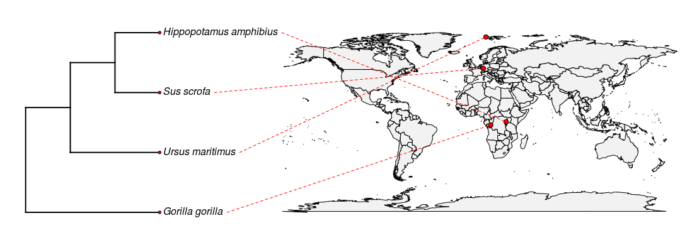

First complete the introductory tutorials on rgbif and on rotl to familiarize yourself.
https://ropensci.org/tutorials/rotl_tutorial/
https://ropensci.org/tutorials/rgbif_tutorial/


# How can we combine the geographic information from GBIF and the phylogenetic information from Open Tree?

In order to examine geographic distributions of species, it is useful to tie together information about phylogenetci relationships, which we can get from Open Tree of Life, with information about where individuals of that species are founs.

```r
library(rgbif)
library(rotl)
library(phytools)
```


Lets look for some fun mammal species, 
A polar bear, "Ursus maritimus", a hippo "Hippopotamus amphibius", a gorilla "Gorilla gorilla" and a wild boar "Sus scrofa"
```r
polarbear <-"Ursus maritimus"
hippo <-"Hippopotamus amphibius"
boar <-"Sus scrofa"
gorilla <- "Gorilla gorilla"
mammal_spp <- c(polarbear, boar, gorilla, hippo)
```

We will use GBIF to search for records of these species, and arbitrarily chose the first record returned as the location for the species.

```r
dat1 <- occ_search(scientificName = polarbear, fields=c('name','decimalLatitude', 'decimalLongitude'), limit = 1)
dat2 <- occ_search(scientificName =hippo, fields=c('name','decimalLatitude', 'decimalLongitude'), limit = 1)
dat3 <- occ_search(scientificName = boar,  fields=c('name','decimalLatitude', 'decimalLongitude'), limit = 1)
dat4 <- occ_search(scientificName = gorilla, fields=c('name','decimalLatitude', 'decimalLongitude'), limit = 1)
mammal_locs <- as.data.frame(rbind(dat1$data,dat2$data, dat3$data, dat4$data)) #Combine the data from each species
rownames(mammal_locs) <- mammal_locs[,1] # set the rownames to the taxon names
mammal_latlong <- as.matrix(mammal_locs[,c(3,2)]) #flip the columns to lat, long instead of long,lat
```

Instead of asking about each taxon one at a time, we can use a loop that gets the data for all taxa:

```r
mammal_locs = data.frame(matrix(vector(), 0, 3))
for (taxon in mammal_spp){
  result <- occ_search(scientificName = taxon, 
                   fields=c('name','decimalLatitude', 'decimalLongitude'), limit = 1)
  mammal_locs <- as.data.frame(rbind(mammal_locs,result$data))
}
rownames(mammal_locs) <- mammal_locs[,1]  # set the rownames to the taxon names
mammal_latlong <- as.matrix(mammal_locs[,c(3,2)]) #flip the columsn to lat, long instead of long,lat
```

Now we have matrix of locations - we need a tree for our of species!
```r
taxa <- tnrs_match_names(mammal_spp, context="Animals")
tr <- tol_induced_subtree(ott_id(taxa), label="name")
plot(tr)
```

#enforce newick style tip names, by replacing spaces with underscores
```r
rownames(mammal_latlong) <- gsub(' ','_',rownames(mammal_latlong)) 
```
Trees from OpenTree don't automatically come with branch lengths - we need to infer some branch lengths for this tree in order to plot it.
```r
tr_bl<-compute.brlen(tr) 
```

Combine the phylogeney and the mapped locations
```r
tdobj<-phylo.to.map(tr_bl,mammal_latlong,plot=FALSE)
plot(tdobj,direction="rightwards",ftype="i")
```

```{r echo=FALSE, out.width='100%'}
# All defaults

```